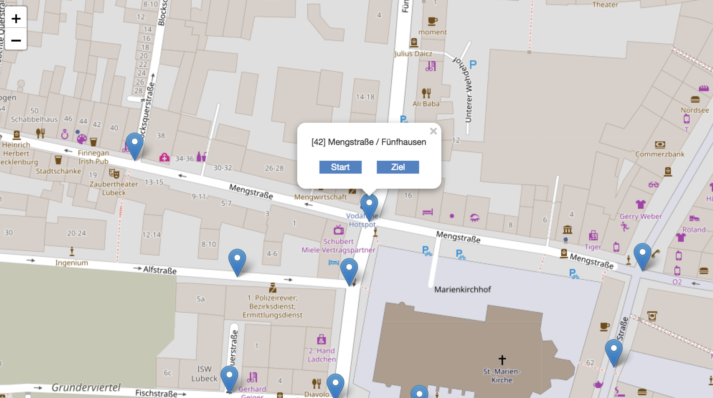
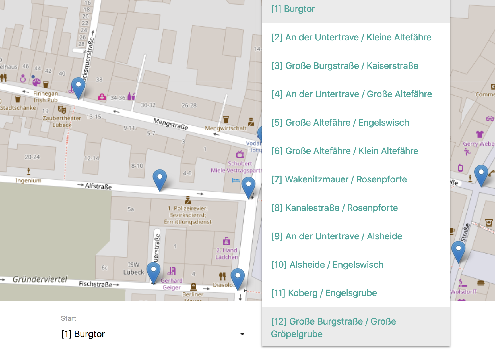
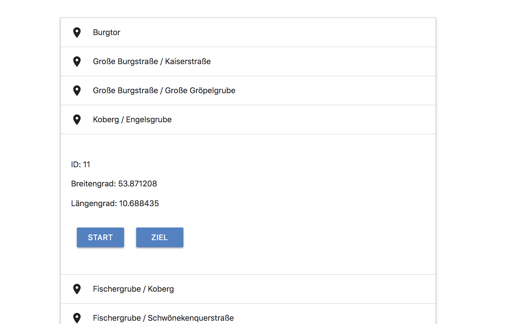

# Pathfinding in Lübeck 

Based on dijkstra algorithm.  
More information can be found [here](https://en.wikipedia.org/wiki/Dijkstra%27s_algorithm#Pseudocode).


## Requirements

- nodejs
- npm or yarn 

## Development
 ```
 $ npm i
 $ npm run start
 ``` 
 Local dev server will start on port 8080.
 
 ## Build

 ```
 $ npm i
 $ npm run build
 ``` 
 
 Files will be compiled and can be found in the docs directory.
 
 ## Usage
 
 
 
 > Click on a marker to mark a new start / destination node.
 
 
 
 > Select start / destination from list.
 
 
 
 > Direction list shows the waypoints.  
 Select waypoint as new start / destination.